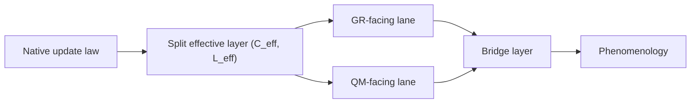
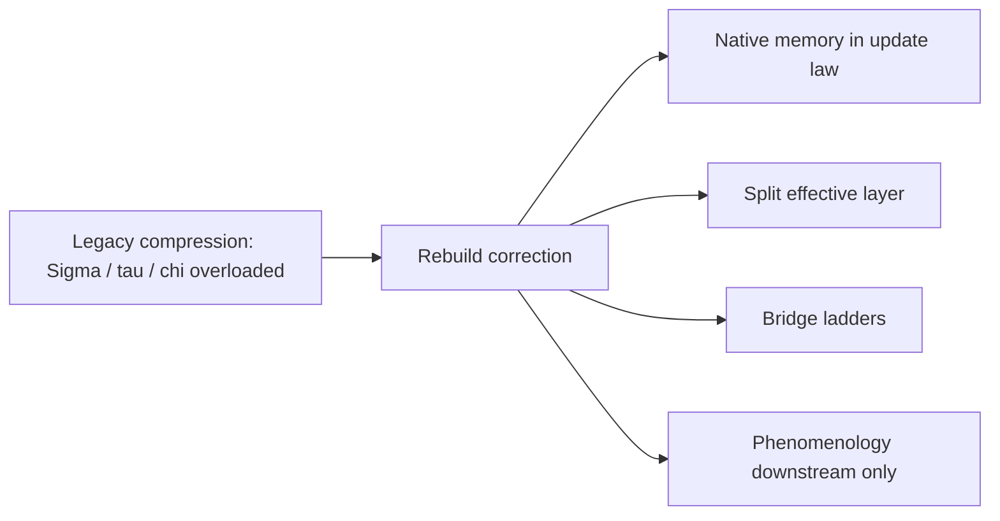
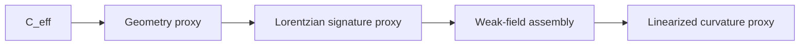
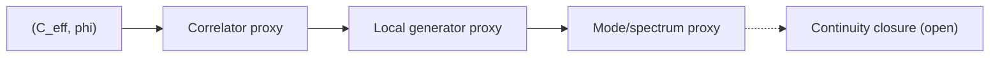
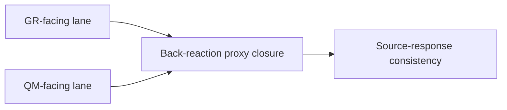
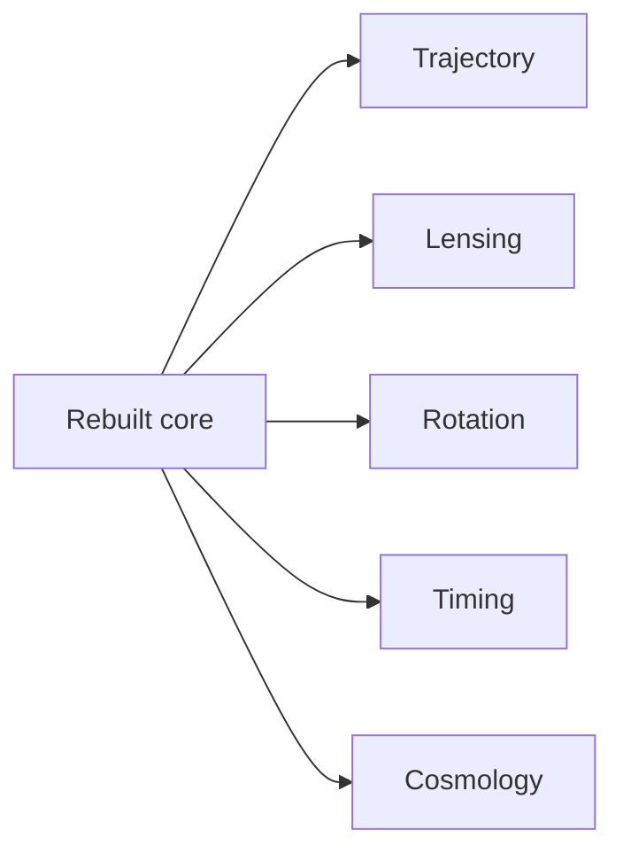
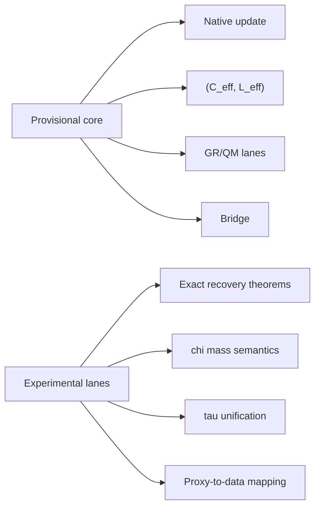

# Paper Figures Draft v1

Type: `note`
ID: `NOTE-GOV-018`
Status: `draft`
Author: `C.D Gabriel`

## Objective

Turn the figure plan into near-production drafts that can be implemented directly in the paper.

## Figure 1: rebuilt QNG architecture

Caption draft:

High-level architecture of the rebuilt QNG program. A native memory-sensitive update law feeds a split effective layer `(C_eff, L_eff)`, from which GR-facing, QM-facing, bridge, and downstream phenomenology layers are derived. The ordering is directional: phenomenology is downstream of the core and does not define ontology.

Suggested diagram:

## Figure 2: legacy compression vs rebuild correction

Caption draft:

Structural correction introduced by the rebuild. The older project compressed stability, memory, mass semantics, and phenomenology into a small number of overloaded objects. The rebuilt program separates these roles across native dynamics, the split effective layer, bridge ladders, and downstream phenomenology.

Suggested diagram:

## Figure 3: GR recovery ladder

Caption draft:

Current GR-facing recovery ladder in the rebuilt theory. The strongest present lane runs from `C_eff` through geometry and signature proxies to weak-field assembly and linearized curvature. This lane is currently more mature than the QM-facing lane.

Suggested diagram:

## Figure 4: QM recovery ladder

Caption draft:

Current QM-facing recovery ladder in the rebuilt theory. The strongest present path runs from `(C_eff, phi)` through a correlator proxy, local generator structure, and mode/spectrum organization. Continuity-style closure remains open and should not be shown as recovered.

Suggested diagram:

## Figure 5: bridge and source-response ladder

Caption draft:

Bridge strengthening in the rebuilt program. The bridge is no longer only a shared vocabulary between GR-facing and QM-facing objects. It now includes back-reaction proxy closure and a first source-response consistency step.

Suggested diagram:

## Figure 6: phenomenology descent map

Caption draft:

Downstream phenomenology in the rebuilt workspace. Application branches are derived after the native theory, effective layer, and bridge ladders are already fixed. This prevents phenomenological fit from redefining the ontology.

Suggested diagram:

## Figure 7: support status map

Caption draft:

Support-level map used throughout the rebuilt manuscript. `Proxy-supported` items have explicit bounded definitions and direct validation support; `candidate` items are coherent but not closed; `open` items remain unresolved.

Suggested layout:

- Column 1: `proxy-supported`
- Column 2: `candidate`
- Column 3: `open`

Populate with:

- `proxy-supported`: native update, CPU/GPU agreement, split effective layer, GR weak-field lane, QM generator/spectrum lane, bridge/source-response, phenomenology proxies
- `candidate`: GR recovery program, QM recovery program, unified split-bridge architecture, provisional core backbone
- `open`: exact GR recovery, exact QM recovery, exact closure, final matter ontology, universal `tau`, final `Sigma` status

## Figure 8: freeze core vs experimental lanes

Caption draft:

Separation between the provisional frozen backbone and explicitly experimental lanes. This figure is a governance figure as much as a scientific one: it prevents interpretive drift and keeps open problems from silently entering the canonical core.

Suggested diagram:

## Production notes

- Use rebuilt vocabulary only.
- Do not draw any arrow that implies exact theorem-level recovery.
- Keep `continuity closure` visually marked as open.
- If the figure count must be reduced, keep Figures 1, 3, 4, and 8 first.
