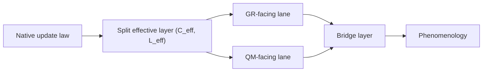

# Figure 1

Title: `rebuilt QNG architecture`
Author: `C.D Gabriel`

Caption:

High-level architecture of the rebuilt QNG program. A native memory-sensitive update law feeds a split effective layer `(C_eff, L_eff)`, from which GR-facing, QM-facing, bridge, and downstream phenomenology layers are derived.

