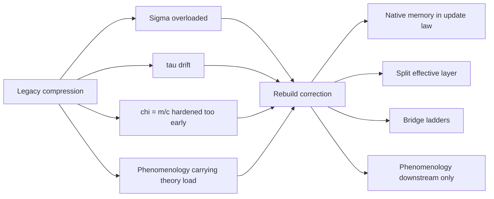

# Figure 2

Title: `legacy compression vs rebuild correction`
Author: `C.D Gabriel`

Caption:

Structural correction introduced by the rebuild. The older project compressed stability, memory, mass semantics, and phenomenology into overloaded objects. The rebuilt program separates these roles across native dynamics, the split effective layer, bridge ladders, and downstream phenomenology.

