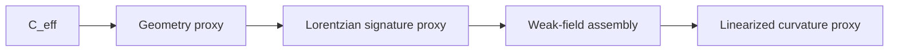

# Figure 3

Title: `GR recovery ladder`
Author: `C.D Gabriel`

Caption:

Current GR-facing recovery ladder in the rebuilt theory. The strongest present lane runs from `C_eff` through geometry and signature proxies to weak-field assembly and linearized curvature.

