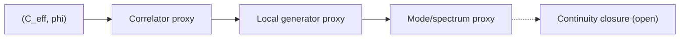

# Figure 4

Title: `QM recovery ladder`
Author: `C.D Gabriel`

Caption:

Current QM-facing recovery ladder in the rebuilt theory. The strongest present path runs from `(C_eff, phi)` through a correlator proxy, local generator structure, and mode/spectrum organization. Continuity-style closure remains open.

