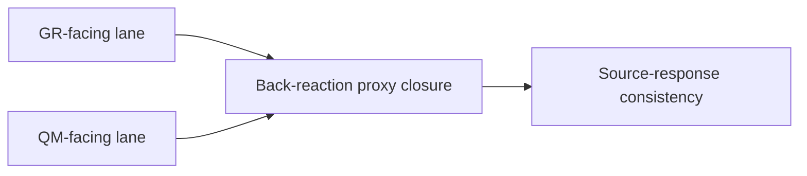

# Figure 5

Title: `bridge and source-response`
Author: `C.D Gabriel`

Caption:

Bridge strengthening in the rebuilt program. The bridge is no longer only a shared vocabulary between GR-facing and QM-facing objects. It now includes back-reaction proxy closure and a first source-response consistency step.

