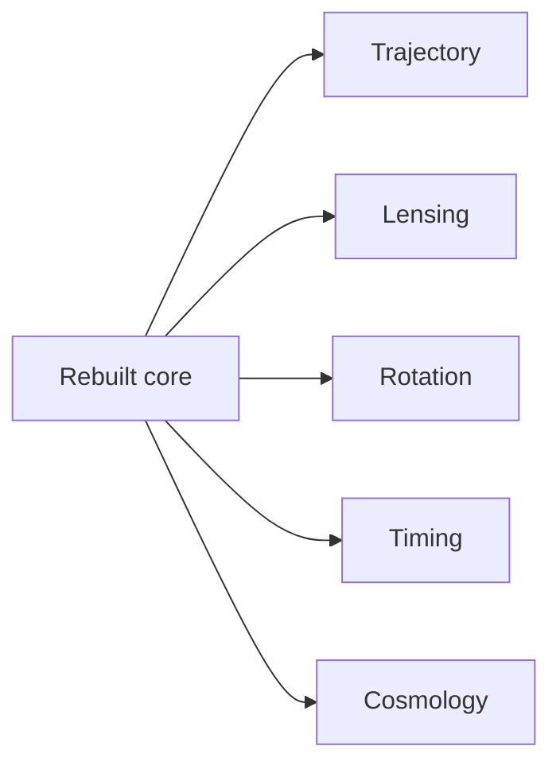

# Figure 6

Title: `phenomenology descent map`
Author: `C.D Gabriel`

Caption:

Downstream phenomenology in the rebuilt workspace. Application branches are derived after the native theory, effective layer, and bridge ladders are already fixed.

