# Figure 7

Title: `support status map`
Author: `C.D Gabriel`

Caption:

Support-level map used throughout the rebuilt manuscript. `Proxy-supported` items have explicit bounded definitions and direct validation support; `candidate` items are coherent but not closed; `open` items remain unresolved.

```mermaid
flowchart TB
    A["Proxy-supported"] --> A1["Native update"]
    A --> A2["CPU/GPU agreement"]
    A --> A3["Split effective layer"]
    A --> A4["GR weak-field lane"]
    A --> A5["QM generator/spectrum lane"]
    A --> A6["Bridge/source-response"]
    A --> A7["Phenomenology proxies"]
    B["Candidate"] --> B1["GR recovery program"]
    B --> B2["QM recovery program"]
    B --> B3["Unified split-bridge architecture"]
    B --> B4["Provisional core backbone"]
    C["Open"] --> C1["Exact GR recovery"]
    C --> C2["Exact QM recovery"]
    C --> C3["Exact closure"]
    C --> C4["Final matter ontology"]
    C --> C5["Universal tau"]
    C --> C6["Final Sigma status"]
```

