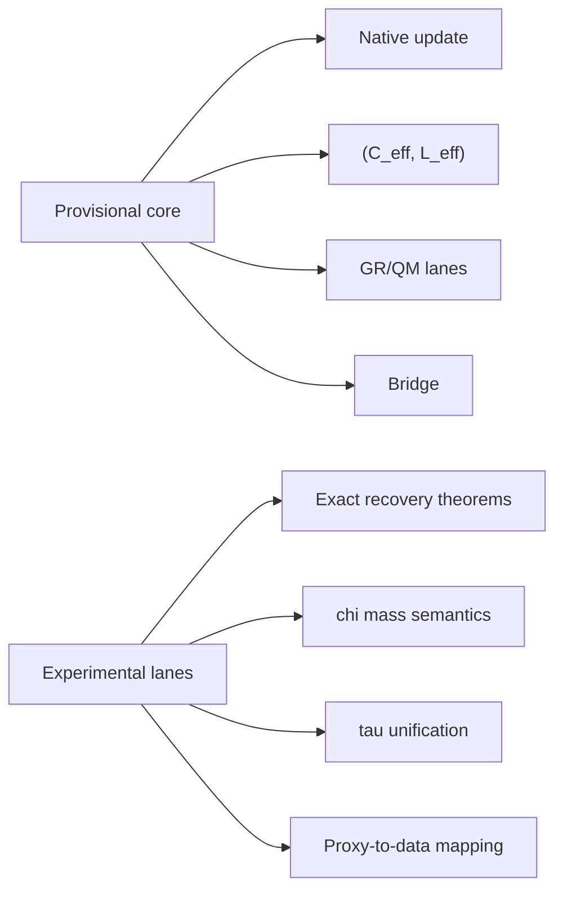

# Figure 8

Title: `freeze core vs experimental lanes`
Author: `C.D Gabriel`

Caption:

Separation between the provisional frozen backbone and explicitly experimental lanes. This figure prevents interpretive drift and keeps open problems from silently entering the canonical core.

