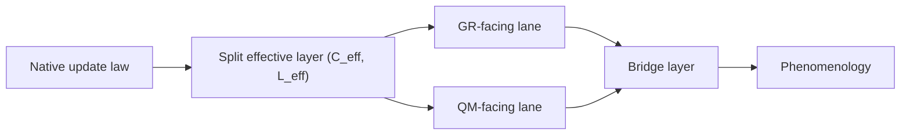
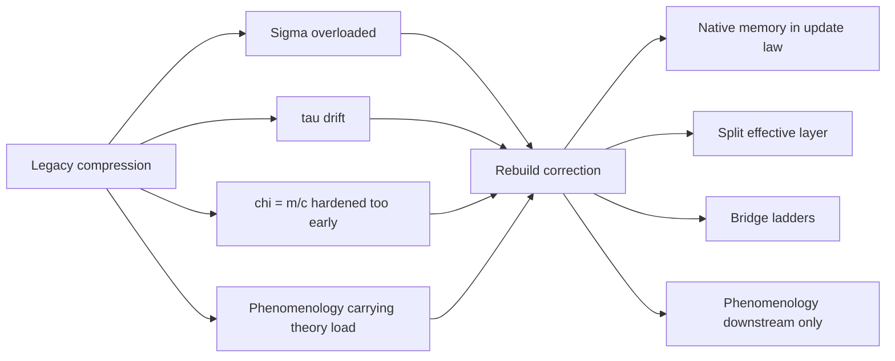
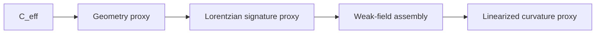
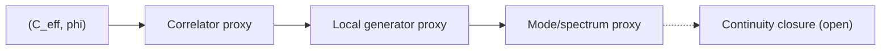
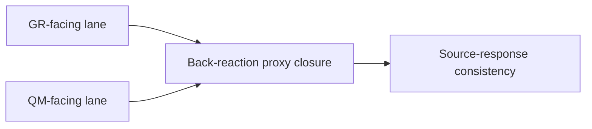
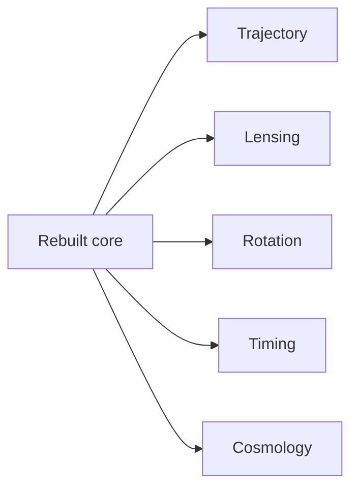
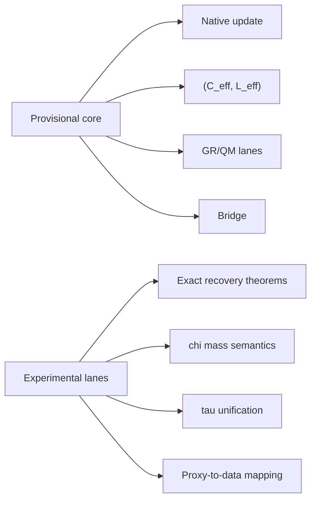

# Paper Figure Pack v1

Type: `note`
ID: `NOTE-EXP-001`
Status: `draft`
Author: `C.D Gabriel`

## Objective

Provide one renderable pack containing all primary manuscript figures for rebuilt QNG.

## Figure 1: rebuilt QNG architecture

## Figure 2: legacy compression vs rebuild correction

## Figure 3: GR recovery ladder

## Figure 4: QM recovery ladder

## Figure 5: bridge and source-response

## Figure 6: phenomenology descent map

## Figure 7: support status map

```mermaid
flowchart TB
    A["Proxy-supported"] --> A1["Native update"]
    A --> A2["CPU/GPU agreement"]
    A --> A3["Split effective layer"]
    A --> A4["GR weak-field lane"]
    A --> A5["QM generator/spectrum lane"]
    A --> A6["Bridge/source-response"]
    A --> A7["Phenomenology proxies"]
    B["Candidate"] --> B1["GR recovery program"]
    B --> B2["QM recovery program"]
    B --> B3["Unified split-bridge architecture"]
    B --> B4["Provisional core backbone"]
    C["Open"] --> C1["Exact GR recovery"]
    C --> C2["Exact QM recovery"]
    C --> C3["Exact closure"]
    C --> C4["Final matter ontology"]
    C --> C5["Universal tau"]
    C --> C6["Final Sigma status"]
```

## Figure 8: freeze core vs experimental lanes

